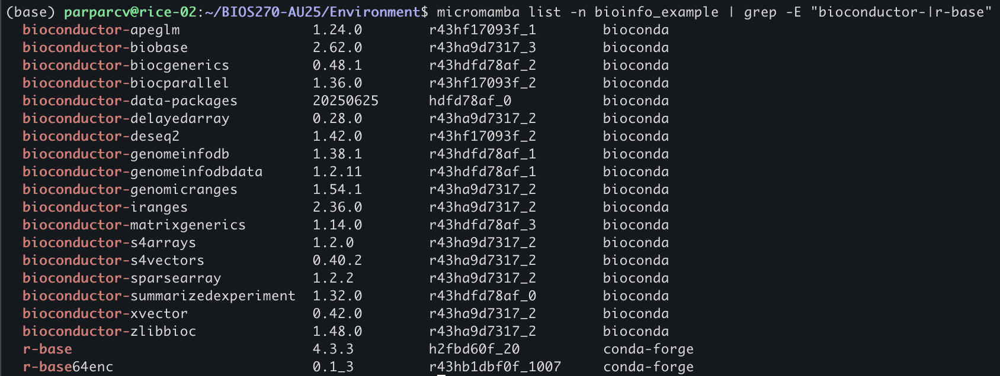
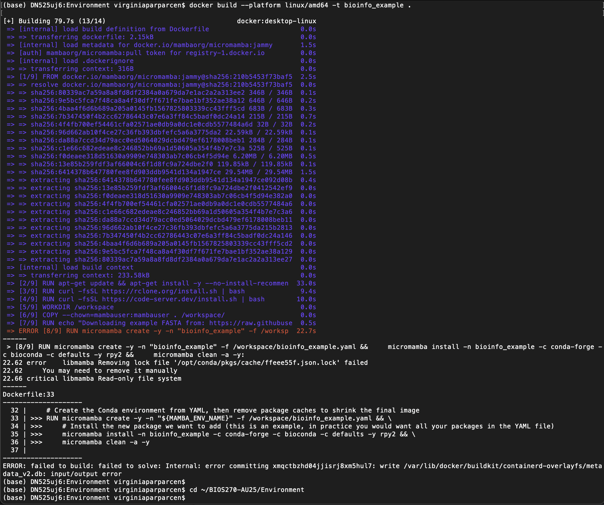
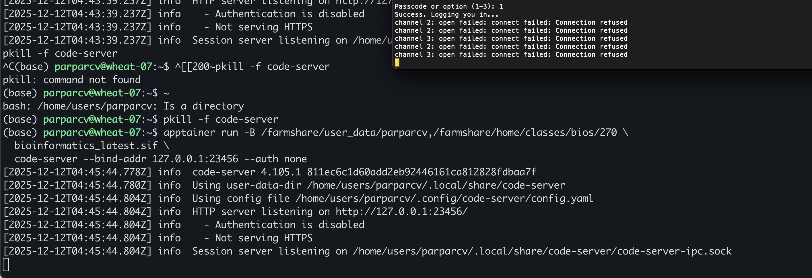

Write-up 2: Environment  
Name: Ginny Parparcen Student ID: parparcv  
Date: 12/11/2025  

1. Micromamba
Running sample scripts
  
  
  

Changes between yaml files
- added the package rpy2  
- The latest lost the defaults channel

What micromamba command can you use to list all created environemnts?
- micromamba env list

What micromamba command can you use to list all packages installed in a specific environment?
- micromamba list -n <env_name>

What micromamba command can you use to remove a package?
- micromamba remove -n <env_name> <package_name>

What micromamba command can you use to install a package from a specific channel?
- micromamba install -n <env_name> -c <channel_name> <package_name>

What micromamba command can you use to remove an environment?
- micromamba env remove -n <env_name>

What are all the r-base and Bioconductor packages that were installed in the bioinfo_example environment? (Hint: You may want to use one of the commands from your answers to the above questions, and combine it with the grep command.)
  

2. Container  
I was not able to build the image since there's not enough space on my laptop
  

This also did not work
  

